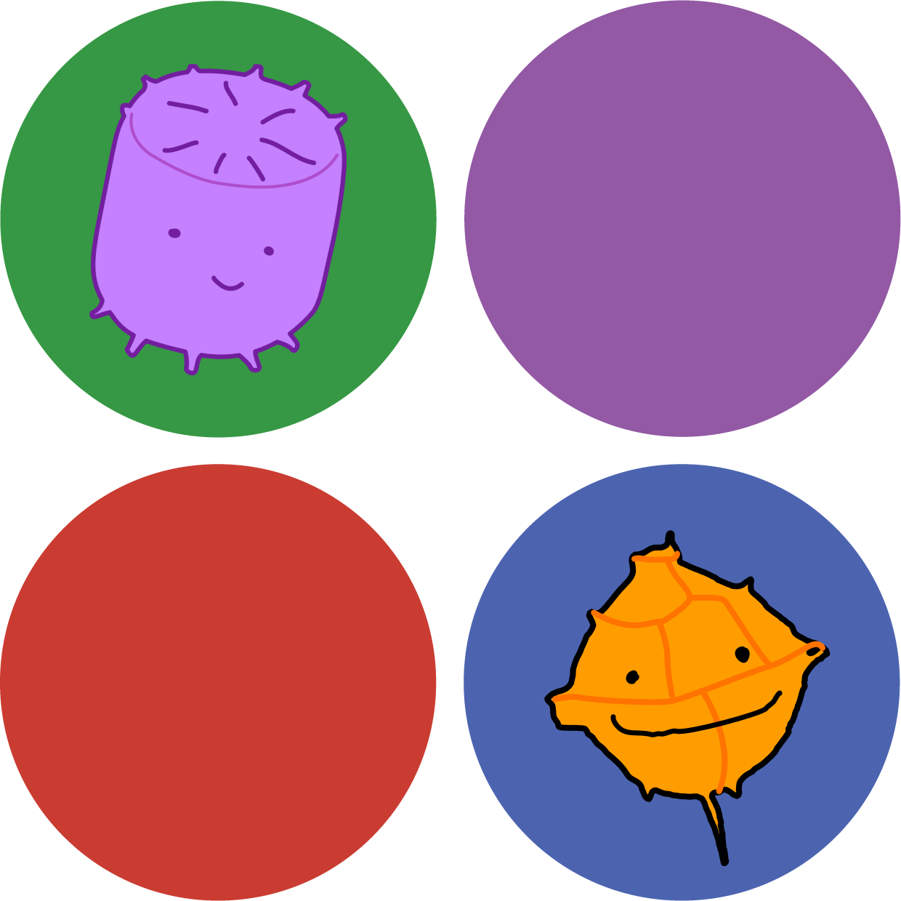

<table>
  <tr>
    <td></td>
    <td><h1>MetaCommunityMetrics</h1></td>
  </tr>
</table>


`MetaCommunityMetrics` is a collection of metrics for analyzing ecological community datasets across space and time in Julia. The current version is compatible with `julia` version 1.9.3.

[](https://github.com/cralibe/MetaCommunityMetrics.jl/actions/workflows/CI.yml?query=branch%3Amain)
[](https://cralibe.github.io/MetaCommunityMetrics.jl/)
[](https://codecov.io/github/cralibe/MetaCommunityMetrics.jl)


## An Overview
This package is a comprehensive toolkit designed to characterize the spatiotemporal structure and dynamics of a metacommunity, a network of communities linked by the dispersal of multiple, interacting species, each with unique niche breadths. It includes functions to calculate a range of specific metrics, which have been previously implemented in `R` and proven valuable for ecological community analysis. 

However, they usually come with high computational costs, especially for large spatiotemporal community datasets. To address this issue, MetaCommunityMetrics.jl was developed in `Julia`, a programming language known for its efficiency in handling computationally intensive tasks. This implementation significantly improves the efficiency of calculating these metrics, making it a powerful tool for ecological community analysis. 

These metrics include:
- Beta diversity decomposition in space/time: total diversity, species replacement (turnover), and richness differences for both presence-absence and abundance data
- Dispersal-niche continuum index (DNCI) to evaluate the degree to which communities are influenced by dispersal processes and niche breadth
- Niche overlap indices to determine the extent of niche sharing among species within the metacommunity
- The proportion of habitat patches occupied by each species
- The variability of community composition across different spatial and temporal scales
- Niche hypervolume measurements (individual species, average, and between-species dissimilarities)


## Getting Started

### Installation

To install MetaCommunityMetrics, use the following command:

```julia
using Pkg

Pkg.add("MetaCommunityMetrics")
```
### Acessing Help File

For all the functions in this package, detailed instructions and examples can be accessed here or by switching to help mode in the `Julia` REPL. To switch to help mode in the `Julia` REPL, user can press `?` at an empty `julia>` prompt , then type a keyword (e.g. the name of the function) to retrieve the corresponding help file. 

## Function Documentation

- [`Beta Diversity`](https://cralibe.github.io/MetaCommunityMetrics.jl/BetaDiversity/)
- [`DNCI`](https://cralibe.github.io/MetaCommunityMetrics.jl/DNCI/)
- [`Niche Overlap Index`](https://cralibe.github.io/MetaCommunityMetrics.jl/NicheOverlapIndex/)
- [`Occupied Patches Proportion`](https://cralibe.github.io/MetaCommunityMetrics.jl/OccupiedPatchesProportion/)
- [`Variability Metrics`](https://cralibe.github.io/MetaCommunityMetrics.jl/VariabilityMetrics/)
- [`Hypervolume`] (https://cralibe.github.io/MetaCommunityMetrics.jl/Hypervolume/)

## Comparison between Julia and R implementations
- [`Validation Results`] (https://cralibe.github.io/MetaCommunityMetrics.jl/Validation)
- [`Benchmarking Results`](https://cralibe.github.io/MetaCommunityMetrics.jl/Benchmarking/)


## Accessing the Sample Data for exploring the functions
This package used a subset of rodent data that is available in the Portal Project: a long-term study of a Chihuahuan desert ecosystem (Ernest et al. 2018) as the sample data. The rodent abundance data were selected from 2010 to 2023. Abundance data were collected monthly across 24 sites, and 21 species were recorded in total. There are 117 sampling events in total. Most sampling occurred monthly, though some months during the selected period were not sampled. Additionally, we simulated spatial coordinates, temperature, and precipitation data for all sampling sites, as these are required by some functions in our package.

Before using any functions from this package, we need to remove species that were absent and sites that were empty during the entire selected period, as this can occur when subsetting data. For computational convenience, we converted sampling dates to integers and stored them as `Sampling_date_order`. The sample data provide by our package has been already filtered based on these two conditions. The scripts to download and wrangle the original data can be found here:

- [Downloading the rodent data](https://github.com/cralibe/MetaCommunityMetrics.jl/blob/main/data/01_Downloading_Data.R)
- [Data Wrangling](https://github.com/cralibe/MetaCommunityMetrics.jl/blob/main/data/02_Data_Wrangling.jl)

To assess the sample data, use the following command:
```julia
using MetaCommunityMetrics

load_sample_data()
```

### Example
```@jildoctest
julia> using MetaCommunityMetrics

julia> load_sample_data()
53352×12 DataFrame
   Row │ Year   Month  Day    Sampling_date_order  plot   Species  Abundance  Presence  Latitude  Longitude  standardized_temperature  standardized_precipitation 
       │ Int64  Int64  Int64  Int64                Int64  String3  Int64      Int64     Float64   Float64    Float64                   Float64                    
───────┼──────────────────────────────────────────────────────────────────────────────────────────────────────────────────────────────────────────────────────────
     1 │  2010      1     16                    1      1  BA               0         0      35.0     -110.0                  0.829467                -1.4024
     2 │  2010      1     16                    1      2  BA               0         0      35.0     -109.5                 -1.12294                 -0.0519895
     3 │  2010      1     16                    1      4  BA               0         0      35.0     -108.5                 -0.409808                -0.803663
     4 │  2010      1     16                    1      8  BA               0         0      35.5     -109.5                 -1.35913                 -0.646369
     5 │  2010      1     16                    1      9  BA               0         0      35.5     -109.0                  0.0822                   1.09485
   ⋮   │   ⋮      ⋮      ⋮             ⋮             ⋮       ⋮         ⋮         ⋮         ⋮          ⋮                 ⋮                          ⋮
 53348 │  2023      3     21                  117      9  SH               0         0      35.5     -109.0                 -0.571565                -0.836345
 53349 │  2023      3     21                  117     10  SH               0         0      35.5     -108.5                 -2.33729                 -0.398522
 53350 │  2023      3     21                  117     12  SH               1         1      35.5     -107.5                  0.547169                 1.03257
 53351 │  2023      3     21                  117     16  SH               0         0      36.0     -108.5                 -0.815015                 0.95971
 53352 │  2023      3     21                  117     23  SH               0         0      36.5     -108.0                  0.48949                 -1.59416
                                                                                                                                                53342 rows omitted
```

## Acknowledgment
We are grateful to the authors of the pre-existing R package/implementation that we have
implemented in MetaCommunityMetrics.jl. We express our gratitude to everyone who has
tried out this package and provided feedback on how to improve it, especially people from
the Entomological Data Science Lab at Cornell University. 

This package includes re-implementation and adaptations of functions from the R packages `adespatial` (licensed under GPL-3), `vegan` (licensed under GPL-2 or later), `DNCImper` (licensed under GPL-3), and `MVNH` (licensed under GPL-3). The original packages and their documentation are available at:

- `adespatial`: [https://cran.r-project.org/web/packages/adespatial/index.html](https://cran.r-project.org/web/packages/adespatial/index.html)
- `vegan`: [https://cran.r-project.org/web/packages/vegan/index.html](https://cran.r-project.org/web/packages/vegan/index.html)
- `DNCImper`: [https://github.com/Corentin-Gibert-Paleontology/DNCImper](https://github.com/Corentin-Gibert-Paleontology/DNCImper)
- `MVNH` : [https://github.com/lvmuyang/MVNH] (https://github.com/lvmuyang/MVNH)

This package also includes re-implementation and adaptations of scripts that are provided by these papers:
- Wang, S., Lamy, T., Hallett, L. M., & Loreau, M. (2019). Stability and synchrony across ecological hierarchies in heterogeneous metacommunities: linking theory to data. Ecography, 42(6), 1200-1211. https://doi.org:https://doi.org/10.1111/ecog.04290
- Guzman, L. M., Thompson, P. L., Viana, D. S., Vanschoenwinkel, B., Horvath, Z., Ptacnik, R., ... & Chase, J. M. (2022). Accounting for temporal change in multiple biodiversity patterns improves the inference of metacommunity processes. Ecology, 103(6), e3683. https://doi.org:https://doi.org/10.1002/ecy.3683

Please refer to these sources for full details on the original implementations and licenses.

## License
This project is licensed under the terms of the GNU General Public License v3.0. See the LICENSE file for more details.

## Contributing
We welcome contributions! To contribute:
1. Fork the repository
2. Create a new branch
3. Make well commmented commits
4. Submit a pull request

Please follow Julia community coding standards and ensure all tests pass.

### Reporting Issues and Needing Support
If you encounter bugs, have feature requests, or need any support, please open an issue on our 
[GitHub Issues page](https://github.com/cralibe/MetaCommunityMetrics.jl/issues).

## References
Ernest, S. M., Yenni, G. M., Allington, G., Bledsoe, E. K., Christensen, E. M., Diaz, R. M., ... & Valone, T. J. (2018). The Portal Project: a long-term study of a Chihuahuan desert ecosystem. BioRxiv, 332783. https://doi.org/10.1101/332783