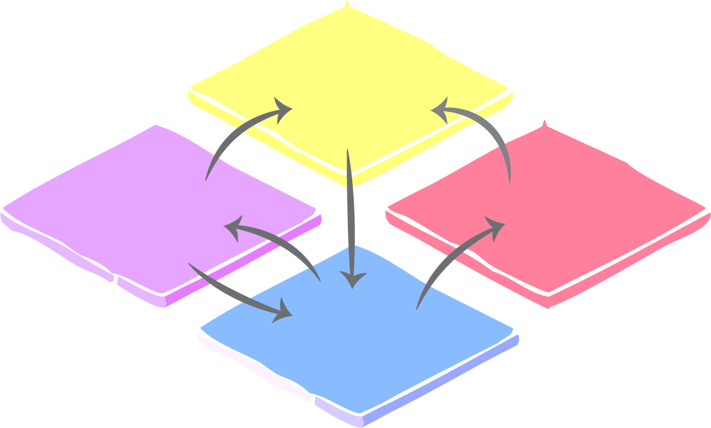

<p align="center">
  
  <h1>MetaCommunityMetrics</h1>
</p>

`MetaCommunityMetrics` is a collection of tools and utilities for analyzing meta-communities in Julia. The current version is compatible with `julia` version 1.9.3.

## An Overview
This package is a comprehensive toolkit designed to characterize the spatiotemporal structure and dynamics of a metacommunity—a network of communities linked by the dispersal of multiple, interacting species, each with unique niche breadths. It includes functions to calculate a range of specific metrics, which have been previously implemented in R and proven valuable for metacommunity analysis. 

However, they come with high computational costs, especially for large species community datasets. To address this issue, MetaCommunityMetrics.jl was developed in Julia, a programming language known for its efficiency in handling computationally intensive tasks. This implementation significantly improves the efficiency of calculating these metrics, making it a powerful tool for metacommunity analysis. 

These metrics include:
- Averaged beta diversity decomposition in space/time: total diversity, species replacement (turnover), and richness differences for both presence-absence and abundance data
- Dispersal-niche continuum index to evaluate the degree to which communities are influenced by dispersal processes and niche breadth
- Niche overlap indices to determine the extent of niche sharing among species within the metacommunity
- The proportion of habitat patches occupied by each species
- The variability of community composition across different spatial and temporal scales


## Getting Started

### Installation

To install MetaCommunityMetrics, use the following command:

```julia
using Pkg

Pkg.add("MetaCommunityMetrics")

using MetaCommunityMetrics
```
### Sample Data
To assess the sample data, use the following command:
```julia
using MetaCommunityMetrics

load_sample_data()
```

### Example
```@jildoctest
julia> using MetaCommunityMetrics

julia> load_sample_data()
48735×10 DataFrame
   Row │ Year   Month  Day    Sampling_date_order  plot   Species  Abundance  Presence  Latitude  Longitude 
       │ Int64  Int64  Int64  Int64                Int64  String3  Int64      Int64     Float64   Float64   
───────┼────────────────────────────────────────────────────────────────────────────────────────────────────
     1 │  2010      1     16                    1      1  BA               0         0      35.0     -110.0
     2 │  2010      1     16                    1      2  BA               0         0      35.0     -109.5
     3 │  2010      1     16                    1      8  BA               0         0      35.5     -109.5
     4 │  2010      1     16                    1      9  BA               0         0      35.5     -109.0
     5 │  2010      1     16                    1     11  BA               0         0      35.5     -108.0
     6 │  2010      1     16                    1     14  BA               0         0      36.0     -109.5
     7 │  2010      1     16                    1     17  BA               0         0      36.0     -108.0
     8 │  2010      1     16                    1     22  BA               0         0      36.5     -108.5
     9 │  2010      1     16                    1      6  BA               0         0      35.0     -107.5
    10 │  2010      1     16                    1     13  BA               0         0      36.0     -110.0
    11 │  2010      1     16                    1     15  BA               0         0      36.0     -109.0
    12 │  2010      1     16                    1     20  BA               0         0      36.5     -109.5
   ⋮   │   ⋮      ⋮      ⋮             ⋮             ⋮       ⋮         ⋮         ⋮         ⋮          ⋮
 48725 │  2023      3     21                  117     15  SH               1         1      36.0     -109.0
 48726 │  2023      3     21                  117     19  SH               0         0      36.5     -110.0
 48727 │  2023      3     21                  117     20  SH               0         0      36.5     -109.5
 48728 │  2023      3     21                  117     21  SH               0         0      36.5     -109.0
 48729 │  2023      3     21                  117     22  SH               0         0      36.5     -108.5
 48730 │  2023      3     21                  117      1  SH               0         0      35.0     -110.0
 48731 │  2023      3     21                  117      9  SH               0         0      35.5     -109.0
 48732 │  2023      3     21                  117     10  SH               0         0      35.5     -108.5
 48733 │  2023      3     21                  117     12  SH               1         1      35.5     -107.5
 48734 │  2023      3     21                  117     16  SH               0         0      36.0     -108.5
 48735 │  2023      3     21                  117     23  SH               0         0      36.5     -108.0
                                                                                          48712 rows omitted
```

[](https://github.com/cralibe/MetaCommunityMetrics.jl/actions/workflows/CI.yml?query=branch%3Amain)
[](https://cralibe.github.io/MetaCommunityMetrics.jl/)
[](https://codecov.io/github/cralibe/MetaCommunityMetrics.jl)

