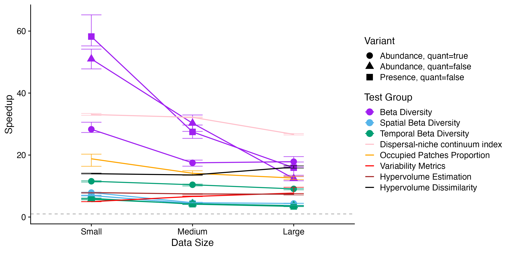

# Benchmark Results
```@meta
CurrentModule = MetaCommunityMetrics
```
## Computational Resources
*All benchmarks were performed on the same machine to ensure consistent comparisons.*
- **CPU**: Apple M4
- **Number of Cores**: 10
- **Memory**: 16GB RAM
- **Operating System**: macOS Sequoia 15.5
- **Julia Version**: 1.10.9
- **R Version**: 4.4.2

## Benchmarking Methods
To assess the efficiency of `MetaCommunityMetrics` compared to equivalent `R` implementations, we benchmark our functions against their `R` counterparts, focusing on execution time and memory usage. The following tables summarize the benchmark results based on 100 samples each. 

We tested using datasets of three sizes:
- Small (5,325 observations)
- Medium (26,676 observations) 
- Large (53,352 observations)

The large dataset is the sample data included with `MetaCommunityMetrics`, accessible via `load_sample_data()`. The small and medium datasets can be accessed [`here`](https://github.com/cralibe/MetaCommunityMetrics.jl/tree/main/data/data_for_testing).

Each function was benchmarked using 100 samples in both `BenchmarkTools.jl` in `Julia` and `bench::mark()` in `R` to ensure robust statistical sampling. For memory usage comparisons:

- In `Julia`, we report the `memory estimate` from `BenchmarkTools.jl`, which measures bytes allocated during the trial with minimum elapsed time
- In `R`, we report the `mem_alloc` metric from `bench::mark()`, which tracks R heap allocations

According to documentation, the `Julia` metric measures total memory allocation during execution, while the `R` metric specifically tracks heap allocations within the R runtime, excluding "memory allocated outside the R heap, e.g., by `malloc()` or `new` directly." Due to differences in language implementation and measurement methodology, direct numerical comparisons between languages should be interpreted with caution.

## Speedup Summary
*Below is a plot showing the speedup of all benchmarked functions across the three datasets (small, medium and large). Speedup is calculated as the `R` median execution time divided by the `Julia` median execution time.*



## Benchmark Results in Details
All times are in millisecond (ms), and memory is in mebibytes (MiB). All values are rounded up to 4 decimal places.

### Median Execution time and Speedup Values
*95% confidence interval is reported.*

| TestCase                                         | DataSize | `Julia`      | `R`        | Speedup        | Lower CI | Upper CI |
|--------------------------------------------------|----------|--------------|------------|----------------|----------|----------|
| Beta Diversity (Abundance, quant=true)           | Large    | 0.1332       | 4.3445     | 32.6197        | 27.5722  | 36.8202  |
| Beta Diversity (Abundance, quant=true)           | Medium   | 0.0687       | 2.1992     | 32.0264        | 29.0750  | 33.1992  |
| Beta Diversity (Abundance, quant=true)           | Small    | 0.0378       | 1.1609     | 30.7185        | 29.0248  | 32.2305  |
| Beta Diversity (Abundance, quant=false)          | Large    | 0.0161       | 0.4163     | 25.8141        | 23.3637  | 27.4420  |
| Beta Diversity (Abundance, quant=false)          | Medium   | 0.0132       | 0.3424     | 25.9220        | 22.0375  | 33.5185  |
| Beta Diversity (Abundance, quant=false)          | Small    | 0.0078       | 0.2515     | 32.1912        | 30.8441  | 35.8422  |
| Beta Diversity (Presence, quant=false)           | Large    | 0.0159       | 0.3982     | 25.0176        | 23.6800  | 25.7236  |
| Beta Diversity (Presence, quant=false)           | Medium   | 0.0087       | 0.3823     | 43.9074        | 38.6950  | 49.6426  |
| Beta Diversity (Presence, quant=false)           | Small    | 0.0053       | 0.2564     | 48.6391        | 45.4927  | 51.1281  |
| Spatial Beta Diversity (Abundance, quant=true)   | Large    | 1.1301       | 20.2642    | 17.9316        | 17.0000  | 19.2013  |
| Spatial Beta Diversity (Abundance, quant=true)   | Medium   | 0.8479       | 18.4196    | 21.7233        | 19.7421  | 22.9488  |
| Spatial Beta Diversity (Abundance, quant=true)   | Small    | 0.6572       | 17.1660    | 26.1205        | 24.6700  | 27.1604  |
| Spatial Beta Diversity (Abundance, quant=false)  | Large    | 1.0138       | 11.6479    | 11.4890        | 10.5726  | 12.5365  |
| Spatial Beta Diversity (Abundance, quant=false)  | Medium   | 0.7158       | 12.4047    | 17.3305        | 16.6366  | 18.2021  |
| Spatial Beta Diversity (Abundance, quant=false)  | Small    | 0.5371       | 11.3735    | 21.1747        | 19.9476  | 22.2527  |
| Spatial Beta Diversity (Presence, quant=false)   | Large    | 1.0038       | 13.1005    | 13.0507        | 12.0992  | 13.6914  |
| Spatial Beta Diversity (Presence, quant=false)   | Medium   | 0.7014       | 12.5121    | 17.8399        | 17.0997  | 18.9505  |
| Spatial Beta Diversity (Presence, quant=false)   | Small    | 0.5451       | 12.7800    | 23.4451        | 21.7508  | 25.2425  |
| Temporal Beta Diversity (Abundance, quant=true)  | Large    | 4.7010       | 110.1159   | 23.4240        | 21.9434  | 24.7747  |
| Temporal Beta Diversity (Abundance, quant=true)  | Medium   | 4.1895       | 114.4033   | 27.3070        | 25.3973  | 28.7955  |
| Temporal Beta Diversity (Abundance, quant=true)  | Small    | 3.9819       | 105.3824   | 26.4657        | 24.9444  | 27.8503  |
| Temporal Beta Diversity (Abundance, quant=false) | Large    | 1.9144       | 16.3894    | 8.5612         | 7.9902   | 9.2707   |
| Temporal Beta Diversity (Abundance, quant=false) | Medium   | 1.2866       | 18.0571    | 14.0352        | 13.4637  | 15.0241  |
| Temporal Beta Diversity (Abundance, quant=false) | Small    | 1.0581       | 16.4432    | 15.5406        | 14.9376  | 16.5922  |
| Temporal Beta Diversity (Presence, quant=false)  | Large    | 1.8345       | 16.9536    | 9.2414         | 8.3232   | 9.5157   |
| Temporal Beta Diversity (Presence, quant=false)  | Medium   | 1.2635       | 17.9482    | 14.2054        | 13.2281  | 15.1381  |
| Temporal Beta Diversity (Presence, quant=false)  | Small    | 1.0301       | 18.9476    | 18.3931        | 17.3701  | 19.2858  |
| Dispersal-niche continuum index                  | Large    | 148.1271     | 23881.0763 | 161.2201       | 159.2672 | 163.6917 |
| Dispersal-niche continuum index                  | Medium   | 55.4244      | 9162.7688  | 165.3202       | 160.2957 | 168.0416 |
| Dispersal-niche continuum index                  | Small    | 12.9935      | 4616.0343  | 355.2583       | 342.8383 | 365.4051 |
| Occupied Patches Proportion                      | Large    | 0.9207       | 15.3826    | 16.7078        | 15.4818  | 17.9102  |
| Occupied Patches Proportion                      | Medium   | 0.6746       | 14.9464    | 22.1544        | 20.3012  | 24.4865  |
| Occupied Patches Proportion                      | Small    | 0.2059       | 11.9799    | 58.1900        | 56.3142  | 62.9279  |
| Variability Metrics                              | Large    | 13.6071      | 289.3605   | 21.2654        | 20.4422  | 22.5900  |
| Variability Metrics                              | Medium   | 7.5160       | 160.1695   | 21.3103        | 19.4700  | 22.7980  |
| Variability Metrics                              | Small    | 2.5891       | 41.8531    | 16.1652        | 14.9528  | 17.4196  |
| Hypervolume Estimation                           | Large    | 0.0037       | 0.0484     | 13.0585        | 12.2988  | 13.9432  |
| Hypervolume Estimation                           | Medium   | 0.0032       | 0.0414     | 13.0690        | 11.7828  | 13.6907  |
| Hypervolume Estimation                           | Small    | 0.0030       | 0.0472     | 15.6100        | 14.2913  | 17.2994  |
| Hypervolume Dissimilarity                        | Large    | 0.0062       | 0.1645     | 26.6729        | 25.9444  | 27.6184  |
| Hypervolume Dissimilarity                        | Medium   | 0.0053       | 0.1615     | 30.2791        | 28.3302  | 34.3604  |
| Hypervolume Dissimilarity                        | Small    | 0.0050       | 0.2097     | 41.5937        | 35.4623  | 51.5496  |

### Memory Usage
#### Benchmarked using Large Dataset
| TestCase                                         |`Julia`       | `R`       |
|--------------------------------------------------|--------------|-----------|
| Beta Diversity (Abundance, quant=true)           | 0.4346       | 0.0566    |
| Beta Diversity (Abundance, quant=false)          | 0.1347       | 0.1252    |
| Beta Diversity (Presence, quant=false)           | 0.1347       | 0.1252    |
| Spatial Beta Diversity (Abundance, quant=true)   | 3.9185       | 3.1177    |
| Spatial Beta Diversity (Abundance, quant=false)  | 3.5173       | 2.6747    |
| Spatial Beta Diversity (Presence, quant=false)   | 3.5173       | 2.6747    |
| Temporal Beta Diversity (Abundance, quant=true)  | 16.8838      | 16.8897   |
| Temporal Beta Diversity (Abundance, quant=false) | 5.6586       | 5.1786    |
| Temporal Beta Diversity (Presence, quant=false)  | 5.6586       | 5.1786    |
| Dispersal-niche continuum index                  | 408.4503     | 8347.5709 |
| Occupied Patches Proportion                      | 2.5230       | 1.8891    |
| Variability Metrics                              | 12.4573      | 60.1502   |
| Hypervolume Estimation                           | 0.0122       | 0.0022    |
| Hypervolume Dissimilarity                        | 0.0168       | 0.0145    |

#### Benchmarked using Medium Dataset
| TestCase                                         |`Julia`       | `R`       |
|--------------------------------------------------|--------------|-----------|
| Beta Diversity (Abundance, quant=true)           | 0.2491       | 0.0357    |
| Beta Diversity (Abundance, quant=false)          | 0.1086       | 0.0798    |
| Beta Diversity (Presence, quant=false)           | 0.1086       | 0.0798    |
| Spatial Beta Diversity (Abundance, quant=true)   | 2.3897       | 2.2770    |
| Spatial Beta Diversity (Abundance, quant=false)  | 1.9910       | 1.8340    |
| Spatial Beta Diversity (Presence, quant=false)   | 1.9910       | 1.8340    |
| Temporal Beta Diversity (Abundance, quant=true)  | 15.2769      | 16.2543   |
| Temporal Beta Diversity (Abundance, quant=false) | 4.1324       | 4.5432    |
| Temporal Beta Diversity (Presence, quant=false)  | 4.1324       | 4.5432    |
| Dispersal-niche continuum index                  | 143.7430     | 3573.2095 |
| Occupied Patches Proportion                      | 1.3019       | 1.4028    |
| Variability Metrics                              | 7.6746       | 32.5536   |
| Hypervolume Estimation                           | 0.0085       | 0.0011    |
| Hypervolume Dissimilarity                        | 0.0120       | 0.0077    |

#### Benchmarked using Small Dataset
| TestCase                                         |`Julia`       | `R`      |
|--------------------------------------------------|--------------|----------|
| Beta Diversity (Abundance, quant=true)           | 0.1225       | 0.0195   |
| Beta Diversity (Abundance, quant=false)          | 0.0883       | 0.0444   |
| Beta Diversity (Presence, quant=false)           | 0.0883       | 0.0444   |
| Spatial Beta Diversity (Abundance, quant=true)   | 1.1334       | 1.2160   |
| Spatial Beta Diversity (Abundance, quant=false)  | 0.7663       | 0.7730   |
| Spatial Beta Diversity (Presence, quant=false)   | 0.7663       | 0.7730   |
| Temporal Beta Diversity (Abundance, quant=true)  | 12.8811      | 15.4375  |
| Temporal Beta Diversity (Abundance, quant=false) | 2.8937       | 3.7264   |
| Temporal Beta Diversity (Presence, quant=false)  | 2.8937       | 3.7264   |
| Dispersal-niche continuum index                  | 37.7612      | 912.5856 |
| Occupied Patches Proportion                      | 0.3249       | 0.4965   |
| Variability Metrics                              | 3.8483       | 10.5805  |
| Hypervolume Estimation                           | 0.0059       | 0.0003   |
| Hypervolume Dissimilarity                        | 0.0082       | 0.0014   |

## Remarks
- For `DNCI_multigroup_result`, 100 permutations are used in both the julia and R function.

## The Scripts Used for Benchmarking
- [`Julia`](https://github.com/cralibe/MetaCommunityMetrics.jl/blob/main/benchmarks/benchmark_julia.jl)
- [`R`](https://github.com/cralibe/MetaCommunityMetrics.jl/blob/main/benchmarks/benchmark_r/benchmark_r.R)

## Packages used for benchmarking
- [`bench`](https://github.com/r-lib/bench)
- [`BenchmarkTools.jl`](https://github.com/JuliaCI/BenchmarkTools.jl)