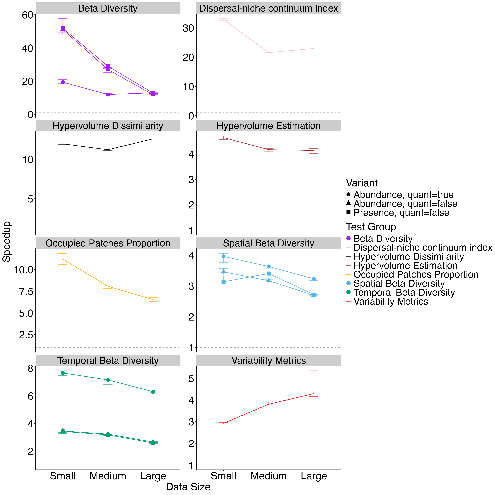

# Benchmarking Results
```@meta
CurrentModule = MetaCommunityMetrics
```
## Computational Resources
*All benchmarks were performed on the same machine to ensure consistent comparisons.*
- **CPU**: Apple M4
- **Number of Cores**: 10
- **Memory**: 16GB RAM
- **Operating System**: macOS Tahoe 26.5.1
- **Julia Version**: 1.12.6
- **R Version**: 4.4.2

## Benchmarking Methods
To assess the efficiency of `MetaCommunityMetrics` compared to equivalent `R` implementations, we benchmark our functions against their `R` counterparts, focusing on execution time and memory usage. The following tables summarize the benchmark results based on 100 samples each. 

We tested using datasets of three sizes:
- Large (53,352 observations)
- Medium (26,676 observations, 50% of the size of the large dataset) 
- Small (5,325 observations, 10% of the size of the large dataset)

The large dataset is the sample data included with `MetaCommunityMetrics`, accessible via `load_sample_data()`. The small and medium datasets can be accessed [`here`](https://github.com/cralibe/MetaCommunityMetrics.jl/tree/main/data/data_for_testing).

Each function was benchmarked using 100 samples in both `BenchmarkTools.jl` in `Julia` and `bench::mark()` in `R` to ensure robust statistical sampling. For memory usage comparisons:

- In `Julia`, we report the `memory estimate` from `BenchmarkTools.jl`, which measures bytes allocated for a given expression per sample.

- In `R`, we report the `mem_alloc` metric from `bench::mark()`, which tracks R heap allocation per sample.

According to documentation, the `Julia` metric measures total memory allocation during execution, while the `R` metric specifically tracks heap allocations within the R runtime, excluding "memory allocated outside the R heap, e.g., by `malloc()` or `new` directly." Due to differences in language implementation and measurement methodology, direct numerical comparisons between languages should be interpreted with caution.

## Speedup Summary
*Below is a plot showing the speedup of all benchmarked functions across the three datasets (small, medium and large). Speedup is calculated as the `R` median execution time divided by the `Julia` median execution time. Median speedup and its confidence interval of each comparison is shown. The grey dashed line shows where speedup equals to 1, that is both `R` and `Julia`'s implementations require the same amount of time. The calcualation of beta diversity has two variants: `quant = true` (abundance data is used) and `quant = false`(occurence data is used).*



## Benchmarking Results in Details
All times are in millisecond (ms), and memory is in mebibytes (MiB). All values are rounded up to 4 decimal places.

### Median Execution Time and Speedup Values
*Bold text indicates the test cases with maximum and minimum speedup values. 95% confidence interval of the speedup is reported.*

| TestCase                                         | Data Size | `Julia`  | `R`        | Speedup | Lower_CI | Upper_CI |
|--------------------------------------------------|-----------|----------|------------|---------|----------|----------|
| Beta Diversity (Abundance, quant=true)           | Large     | 0.1863   | 2.4174     | 12.9794 | 11.6958  | 14.2074  |
| Beta Diversity (Abundance, quant=true)           | Medium    | 0.1144   | 1.3655     | 11.9390 | 11.1776  | 12.5024  |
| Beta Diversity (Abundance, quant=true)           | Small     | 0.0594   | 1.1525     | 19.3906 | 18.7141  | 20.9569  |
| Beta Diversity (Abundance, quant=false)          | Large     | 0.0178   | 0.2096     | 11.7824 | 10.9990  | 12.5062  |
| Beta Diversity (Abundance, quant=false)          | Medium    | 0.0102   | 0.2756     | 26.9933 | 25.2724  | 28.0900  |
| Beta Diversity (Abundance, quant=false)          | Small     | 0.0063   | 0.3219     | 50.9991 | 47.8623  | 53.8532  |
| Beta Diversity (Presence, quant=false)           | Large     | 0.0164   | 0.2101     | 12.8123 | 12.5031  | 13.2637  |
| Beta Diversity (Presence, quant=false)           | Medium    | 0.0107   | 0.3090     | 28.9741 | 27.7734  | 29.8705  |
| **Beta Diversity (Presence, quant=false)**           | **Small**     | **0.0064**   | **0.3300**     | **51.7661** | **49.1421**  | **57.7312**  |
| Spatial Beta Diversity (Abundance, quant=true)   | Large     | 2.8666   | 9.2670     | 3.2327  | 3.1727   | 3.2908   |
| Spatial Beta Diversity (Abundance, quant=true)   | Medium    | 2.5319   | 9.2043     | 3.6354  | 3.5612   | 3.7110   |
| Spatial Beta Diversity (Abundance, quant=true)   | Small     | 2.2322   | 8.8448     | 3.9624  | 3.7595   | 4.0601   |
| Spatial Beta Diversity (Abundance, quant=false)  | Large     | 2.5821   | 6.9715     | 2.6999  | 2.6479   | 2.7323   |
| Spatial Beta Diversity (Abundance, quant=false)  | Medium    | 2.2594   | 7.1675     | 3.1723  | 3.1081   | 3.2173   |
| Spatial Beta Diversity (Abundance, quant=false)  | Small     | 1.9495   | 6.7469     | 3.4607  | 3.3609   | 3.5694   |
| Spatial Beta Diversity (Presence, quant=false)   | Large     | 2.5589   | 6.9638     | 2.7214  | 2.6854   | 2.7404   |
| Spatial Beta Diversity (Presence, quant=false)   | Medium    | 2.1191   | 7.2182     | 3.4063  | 3.3607   | 3.4530   |
| Spatial Beta Diversity (Presence, quant=false)   | Small     | 2.1348   | 6.6972     | 3.1372  | 3.0622   | 3.3289   |
| Temporal Beta Diversity (Abundance, quant=true)  | Large     | 8.4617   | 53.3016    | 6.2991  | 6.1473   | 6.4106   |
| Temporal Beta Diversity (Abundance, quant=true)  | Medium    | 7.5948   | 54.3208    | 7.1523  | 6.8532   | 7.2299   |
| Temporal Beta Diversity (Abundance, quant=true)  | Small     | 6.8641   | 52.5342    | 7.6535  | 7.4632   | 7.8143   |
| Temporal Beta Diversity (Abundance, quant=false) | Large     | 3.6760   | 9.7690     | 2.6575  | 2.6270   | 2.7049   |
| Temporal Beta Diversity (Abundance, quant=false) | Medium    | 2.9893   | 9.6720     | 3.2356  | 3.1837   | 3.3087   |
| Temporal Beta Diversity (Abundance, quant=false) | Small     | 2.6074   | 9.0186     | 3.4588  | 3.3546   | 3.6131   |
| **Temporal Beta Diversity (Presence, quant=false)**  | **Large**    | **3.6227**  | **9.3899**     | **2.5920**  | **2.5601**   | **2.6217**   |
| Temporal Beta Diversity (Presence, quant=false)  | Medium    | 3.0302   | 9.6286     | 3.1775  | 3.1321   | 3.2545   |
| Temporal Beta Diversity (Presence, quant=false)  | Small     | 2.6368   | 9.0206     | 3.4210  | 3.2804   | 3.5372   |
| Dispersal-niche continuum index                  | Large     | 561.0789 | 12894.3232 | 22.9813 | 22.8193  | 23.1827  |
| Dispersal-niche continuum index                  | Medium    | 584.9301 | 12608.5208 | 21.5556 | 21.3908  | 21.6751  |
| Dispersal-niche continuum index                  | Small     | 102.6979 | 3376.0879  | 32.8740 | 32.5948  | 33.2254  |
| Occupied Patches Proportion                      | Large     | 1.3165   | 8.5893     | 6.5241  | 6.2772   | 6.7625   |
| Occupied Patches Proportion                      | Medium    | 1.0342   | 8.3506     | 8.0744  | 7.8170   | 8.4617   |
| Occupied Patches Proportion                      | Small     | 0.7051   | 7.9086     | 11.2169 | 10.5400  | 11.8917  |
| Variability Metrics                              | Large     | 24.1228  | 103.5960   | 4.2945  | 4.1612   | 5.3441   |
| Variability Metrics                              | Medium    | 13.7434  | 52.2772    | 3.8038  | 3.7637   | 3.8944   |
| Variability Metrics                              | Small     | 4.8176   | 14.0789    | 2.9224  | 2.9000   | 2.9532   |
| Hypervolume Estimation                           | Large     | 0.0074   | 0.0307     | 4.1376  | 4.0153   | 4.2168   |
| Hypervolume Estimation                           | Medium    | 0.0063   | 0.0264     | 4.1689  | 4.1026   | 4.2160   |
| Hypervolume Estimation                           | Small     | 0.0057   | 0.0266     | 4.6442  | 4.5666   | 4.7135   |
| Hypervolume Dissimilarity                        | Large     | 0.0111   | 0.1395     | 12.5871 | 12.3381  | 12.9448  |
| Hypervolume Dissimilarity                        | Medium    | 0.0099   | 0.1109     | 11.2035 | 11.0781  | 11.3024  |
| Hypervolume Dissimilarity                        | Small     | 0.0094   | 0.1125     | 11.9475 | 11.8664  | 12.0703  |

### Memory Usage
#### Benchmarked using Large Dataset
*Bold text indicates the test case with the biggest memory usage difference between `Julia` and `R`.*

| TestCase                                         | `Julia`  | `R`     |
|--------------------------------------------------|----------|---------|
| Beta Diversity (Abundance, quant=true)           | 0.4395   | 0.3757  |
| Beta Diversity (Abundance, quant=false)          | 0.0843   | 0.1252  |
| Beta Diversity (Presence, quant=false)           | 0.0843   | 0.1252  |
| Spatial Beta Diversity (Abundance, quant=true)   | 4.0204   | 4.1093  |
| Spatial Beta Diversity (Abundance, quant=false)  | 3.5614   | 2.6637  |
| Spatial Beta Diversity (Presence, quant=false)   | 3.5614   | 2.6637  |
| Temporal Beta Diversity (Abundance, quant=true)  | 17.0817  | 16.8787 |
| Temporal Beta Diversity (Abundance, quant=false) | 5.8182   | 5.1676  |
| Temporal Beta Diversity (Presence, quant=false)  | 5.8182   | 5.1676  |
| **Dispersal-niche continuum index**                 | **127.5234** | **77.7877** |
| Occupied Patches Proportion                      | 1.9796   | 1.9928  |
| Variability Metrics                              | 12.6061  | 60.2264 |
| Hypervolume Estimation                           | 0.0118   | 0.0022  |
| Hypervolume Dissimilarity                        | 0.0198   | 0.0145  |

#### Benchmarked using Medium Dataset
*The test case with the biggest memory usage difference between `Julia` and `R` is highligthed.*

| TestCase                                         | `Julia` | `R`     |
|--------------------------------------------------|---------|---------|
| Beta Diversity (Abundance, quant=true)           | 0.2507  | 0.0357  |
| Beta Diversity (Abundance, quant=false)          | 0.0520  | 0.0798  |
| Beta Diversity (Presence, quant=false)           | 0.0520  | 0.0798  |
| Spatial Beta Diversity (Abundance, quant=true)   | 2.4864  | 2.2737  |
| Spatial Beta Diversity (Abundance, quant=false)  | 2.0302  | 1.8307  |
| Spatial Beta Diversity (Presence, quant=false)   | 2.0302  | 1.8307  |
| Temporal Beta Diversity (Abundance, quant=true)  | 15.4706 | 16.2510 |
| Temporal Beta Diversity (Abundance, quant=false) | 4.2870  | 4.5399  |
| Temporal Beta Diversity (Presence, quant=false)  | 4.2870  | 4.5399  |
| **Dispersal-niche continuum index**                 | **98.4971** | **59.2854** |
| Occupied Patches Proportion                      | 1.0577  | 1.3995  |
| Variability Metrics                              | 7.8169  | 32.5536 |
| Hypervolume Estimation                           | 0.0081  | 0.0011  |
| Hypervolume Dissimilarity                        | 0.0145  | 0.0077  |

#### Benchmarked using Small Dataset
*The test case with the biggest memory usage difference between `Julia` and `R` is highligthed.*

| TestCase                                         | `Julia` | `R`     |
|--------------------------------------------------|---------|---------|
| Beta Diversity (Abundance, quant=true)           | 0.1217  | 0.0195  |
| Beta Diversity (Abundance, quant=false)          | 0.0276  | 0.0444  |
| Beta Diversity (Presence, quant=false)           | 0.0276  | 0.0444  |
| Spatial Beta Diversity (Abundance, quant=true)   | 1.1605  | 1.2127  |
| Spatial Beta Diversity (Abundance, quant=false)  | 0.7342  | 0.7697  |
| Spatial Beta Diversity (Presence, quant=false)   | 0.7342  | 0.7697  |
| Temporal Beta Diversity (Abundance, quant=true)  | 13.0601 | 15.4342 |
| Temporal Beta Diversity (Abundance, quant=false) | 3.0505  | 3.7231  |
| Temporal Beta Diversity (Presence, quant=false)  | 3.0505  | 3.7231  |
| **Dispersal-niche continuum index**                  | **41.7434** | **11.1107** |
| Occupied Patches Proportion                      | 0.2843  | 0.4932  |
| Variability Metrics                              | 3.9590  | 10.5805 |
| Hypervolume Estimation                           | 0.0055  | 0.0003  |
| Hypervolume Dissimilarity                        | 0.0108  | 0.0014  |

## Datasets used for this benchmark
### Large Dataset
```@jildoctest
53352×12 DataFrame
   Row │ Year   Month  Day    Sampling_date_order  plot   Species  Abundance  Presence  Latitude  Longitude  standardized_temperature  standardized_precipitation 
       │ Int64  Int64  Int64  Int64                Int64  String3  Int64      Int64     Float64   Float64    Float64                 Float64                  
───────┼──────────────────────────────────────────────────────────────────────────────────────────────────────────────────────────────────────────────────────
     1 │  2010      1     16                    1      1  BA               0         0      35.0     -110.0                0.829467              -1.4024
     2 │  2010      1     16                    1      2  BA               0         0      35.0     -109.5               -1.12294               -0.0519895
     3 │  2010      1     16                    1      4  BA               0         0      35.0     -108.5               -0.409808              -0.803663
     4 │  2010      1     16                    1      8  BA               0         0      35.5     -109.5               -1.35913               -0.646369
     5 │  2010      1     16                    1      9  BA               0         0      35.5     -109.0                0.0822                 1.09485
   ⋮   │   ⋮      ⋮      ⋮             ⋮             ⋮       ⋮         ⋮         ⋮         ⋮          ⋮                ⋮                        ⋮
 53348 │  2023      3     21                  117      9  SH               0         0      35.5     -109.0               -0.571565              -0.836345
 53349 │  2023      3     21                  117     10  SH               0         0      35.5     -108.5               -2.33729               -0.398522
 53350 │  2023      3     21                  117     12  SH               1         1      35.5     -107.5                0.547169               1.03257
 53351 │  2023      3     21                  117     16  SH               0         0      36.0     -108.5               -0.815015               0.95971
 53352 │  2023      3     21                  117     23  SH               0         0      36.5     -108.0                0.48949               -1.59416
                                                                                                                                            53342 rows omitted
```
### Medium Dataset
```@jildoctest
26676×12 DataFrame
   Row │ Year   Month  Day    Sampling_date_order  plot   Species  Abundance  Presence  Latitude  Longitude  standardized_temperature  standardized_precipitation 
       │ Int64  Int64  Int64  Int64                Int64  String3  Int64      Int64     Float64   Float64    Float64                 Float64                  
───────┼──────────────────────────────────────────────────────────────────────────────────────────────────────────────────────────────────────────────────────
     1 │  2015      7     18                   56     12  PM               0         0      35.5     -107.5              -1.30965                  0.967859
     2 │  2016      8      6                   66     13  SF               0         0      36.0     -110.0               1.45692                  1.77253
     3 │  2017      2     25                   71     21  SF               0         0      36.5     -109.0              -1.50086                  0.993311
     4 │  2018      5     19                   82     16  PB               0         0      36.0     -108.5              -1.2202                   0.684295
   ⋮   │   ⋮      ⋮      ⋮             ⋮             ⋮       ⋮         ⋮         ⋮         ⋮          ⋮                ⋮                        ⋮
 26673 │  2010     11      6                    8     13  BA               0         0      36.0     -110.0              -1.05336                 -0.250324
 26674 │  2013      9     14                   36     12  NA               0         0      35.5     -107.5               0.213222                 0.12
 26675 │  2023      2     18                  116     12  DS               0         0      35.5     -107.5              -0.217475                 0.042571
 26676 │  2014     11     22                   49     13  PF               0         0      36.0     -110.0               0.613491                -1.17076
                                                                                                                                            26668 rows omitted
```
### Small Dataset
```@jildoctest
5335×12 DataFrame
  Row │ Year   Month  Day    Sampling_date_order  plot   Species  Abundance  Presence  Latitude  Longitude  standardized_temperature  standardized_precipitation 
      │ Int64  Int64  Int64  Int64                Int64  String3  Int64      Int64     Float64   Float64    Float64                 Float64                  
──────┼──────────────────────────────────────────────────────────────────────────────────────────────────────────────────────────────────────────────────────
    1 │  2015      7     18                   56     12  PM               0         0      35.5     -107.5               -1.30965                 0.967859
    2 │  2016      8      6                   66     13  SF               0         0      36.0     -110.0                1.45692                 1.77253
    3 │  2017      2     25                   71     21  SF               0         0      36.5     -109.0               -1.50086                 0.993311
    4 │  2018      5     19                   82     16  PB               0         0      36.0     -108.5               -1.2202                  0.684295
  ⋮   │   ⋮      ⋮      ⋮             ⋮             ⋮       ⋮         ⋮         ⋮         ⋮          ⋮                ⋮                        ⋮
 5332 │  2013     11      2                   37     13  RF               0         0      36.0     -110.0                2.07639                 2.72841
 5333 │  2018     11     10                   88      6  PH               0         0      35.0     -107.5               -0.197006                0.842547
 5334 │  2018      3     24                   80      2  DS               0         0      35.0     -109.5               -0.920093               -0.276074
 5335 │  2014      4     26                   42      7  PH               0         0      35.5     -110.0                0.848755               -0.247144
                                                                                                                                            5327 rows omitted
```

## Remarks
- For `DNCI_multigroup_result`, 100 permutations per sample are used in both the `Julia` and `R` implementation, and `parallelComputing` was set to be `TRUE` when benchmarking `DNCImper:::DNCI_multigroup()` in `R`. This means the R implementation distributes permutations across multiple cores, reducing the peak memory footprint per core, which likely contributes to the substantially lower memory usage reported for R compared to Julia. Additionally, direct memory comparisons should be interpreted with caution as Julia reports total memory allocated during execution while R only tracks heap allocations.

## The Scripts Used for Benchmarking
- [`Julia`](https://github.com/cralibe/MetaCommunityMetrics.jl/blob/main/benchmarks/benchmark_julia.jl)
- [`R`](https://github.com/cralibe/MetaCommunityMetrics.jl/blob/main/benchmarks/benchmark_r/benchmark_r.R)

## Packages used for benchmarking
- [`bench`](https://github.com/r-lib/bench)
- [`BenchmarkTools.jl`](https://github.com/JuliaCI/BenchmarkTools.jl)