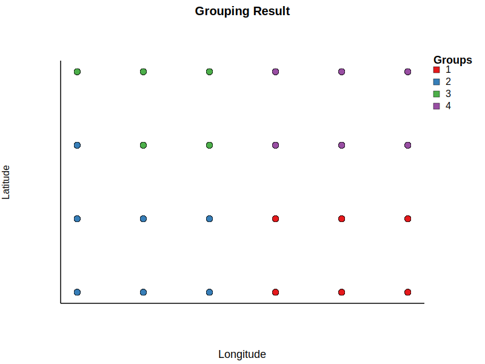

# Dispersal-Niche Continuum Index (DNCI) Functions
```@meta
CurrentModule = MetaCommunityMetrics
```
The `DNCI_multigroup()` function in `MetaCommunityMetrics` is adapted from the 
`DNCI_multigroup()` function in the R package `DNCImper` (https://github.com/Corentin-Gibert-Paleontology/DNCImper), authored by Corentin Gibert, Gilles Escarguel, Annika Vilmi, Jianjun Wang, Aurelien Jamoneau, and Maxime Lopez, and licensed under GPL-3. The underlying methods are described in Gibert and Escarguel (2019) and Vilmi et al. (2021). This function was adapted from R to Julia in August 2024 and is redistributed here under GPL-3 in accordance with the terms of the original license. Modifications include: (1) empty sites and singletons (species occupying only one site at a given time) are permitted, whereas the original implementation does not allow them; and (2) a new output column has 
been added to flag five edge cases where permutation will fail, which are common when simulated data are used.

The function quantifies the balance between dispersal and niche processes within a metacommunity, providing insight into community structure and the relative influence of these two key ecological drivers. Vilmi et al. (2021) developed DNCI based on the PER-SIMPER method introduced by Gibert and Escarguel (2019) to compare observed community composition against three null model scenarios: (1) a niche assembly model that randomizes species identities while maintaining site-level species richness, (2) a dispersal assembly model that randomizes spatial locations while maintaining species-level occurrence frequencies, and (3) a combined model that maintains both constraints. PER-SIMPER uses the SIMPER analysis (Clarke 1993) to generate profiles of species contributions to average between-group dissimilarity for both the observed 
data and the community matrices permuted by the three null models, where dissimilarity is averaged across all site pairs. PER-SIMPER provides qualitative analysis of similarity between the observed SIMPER profile and null model PER-SIMPER profiles, while DNCI quantifies these similarities to calculate the relative importance of dispersal and niche processes.

## Functionality Overview
Unlike the other metrics in this package, DNCI analysis operates on only one time point at a time. Positive DNCI values suggest niche processes dominate community assembly, while negative DNCI values suggest dispersal limitation is more influential at a given time point. DNCI values that do not differ significantly from zero suggest equal contributions from both processes at a given time point. 

Before calculating the DNCI, groupings of sites are required, as the DNCI relies on analyzing community composition across site groups. This package provides `DNCI_create_groups()` to perform the necessary groupings for all time points, and  `DNCI_plot_groups()` to visualize the groupings at a given time points, which are not available in the R implementation. 

## The Functions 
```@docs
DNCI_create_groups
DNCI_plot_groups
```
This plot shows the clustering result for time step 1 based on geographic coordinates:


```@docs
DNCI_multigroup
```

## References
1. Clarke, K. R. (1993). Non‐parametric multivariate analyses of changes in community structure. Australian journal of ecology, 18(1), 117-143. https://doi.org:https://doi.org/10.1111/j.1442-9993.1993.tb00438.x
2. Gibert, C., & Escarguel, G. (2019). PER‐SIMPER—A new tool for inferring community assembly processes from taxon occurrences. Global Ecology and Biogeography, 28(3), 374-385. https://doi.org:https://doi.org/10.1111/geb.12859
3. Vilmi, A., Gibert, C., Escarguel, G., Happonen, K., Heino, J., Jamoneau, A., ... & Wang, J. (2021). Dispersal–niche continuum index: a new quantitative metric for assessing the relative importance of dispersal versus niche processes in community assembly. Ecography, 44(3), 370-379. https://doi.org:https://doi.org/10.1111/ecog.05356

