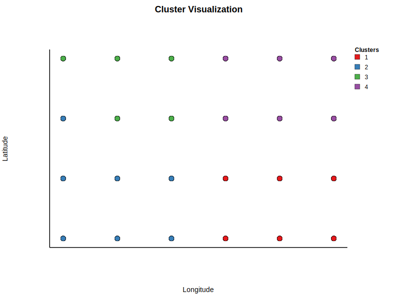

# Dispersal-Niche Continuum Index (DNCI) Functions
```@meta
CurrentModule = MetaCommunityMetrics
```
The Dispersal-Niche Continuum Index (DNCI) functions in `MetaCommunityMetrics` quantifies the balance between dispersal and niche processes within a metacommunity, providing insight into community structure and the relative influence of these two key ecological drivers. The function `DNCI_multigroup`  in this package is adapted from the R package `DNCImper`: Assembly process identification based on SIMPER analysis. These methods, originally developed by Clarke(1993) and later refined by Gibert & Escarguel(2019) and Vilmi et al.(2021), offer powerful tools for identifying the processes underlying species assembly in metacommunities. 

## Background
The DNCI functions is built around the Per-SIMPER and DNCI analyses. PerSIMPER, based on the Similarity Percentage (SIMPER) analysis developed by Clarke (1993), assesses the contribution of individual taxa to overall dissimilarity (OAD) between groups of assemblages. PerSIMPER enhances this by comparing empirical SIMPER plots with randomized plots generated through matrix permutation, which helps identify whether niche, dispersal, or both processes are driving community assembly.

The DNCI (Dispersal-Niche Continuum Index) further extends this approach by transforming the qualitative results of PerSIMPER into a quantitative index, providing a straightforward measure of the influence of niche and dispersal processes on community structure.

## Functionality Overview
The DNCI functions in `MetaCommunityMetrics` allow you to analyze the processes driving species assembly within your dataset. By comparing empirical data with randomized permutations, one can determine the extent to which niche and dispersal processes influence the structure of metacommunities. Before calculating the DNCI, groupings of sites (clusters) are required, as the DNCI relies on analyzing community composition across spatial groups. This package provides a function to perform the necessary clustering, which is not available in the equivalent R package. When the DNCI value is significantly below zero, dispersal processes are likely the dominant drivers of community composition. In contrast, a DNCI value significantly above zero suggests that niche processes play a primary role in shaping community composition. If the DNCI value is not significantly different from zero, it indicates that dispersal and niche processes contribute equally to variations in community composition.

## The Functions 
```@docs
create_clusters
plot_clusters
```
This plot shows the clustering result for time step 1 based on geographic coordinates:


```@docs
DNCI_multigroup
```

## References
1. Clarke, K. R. Non-parametric multivariate analyses of changes in community structure. Australian Journal of Ecology 18, 117-143 (1993). https://doi.org:https://doi.org/10.1111/j.1442-9993.1993.tb00438.x
2. Gibert, C. & Escarguel, G. PER-SIMPER—A new tool for inferring community assembly processes from taxon occurrences. Global Ecology and Biogeography 28, 374-385 (2019). https://doi.org:https://doi.org/10.1111/geb.12859
3. Vilmi, A. et al. Dispersal–niche continuum index: a new quantitative metric for assessing the relative importance of dispersal versus niche processes in community assembly. Ecography 44, 370-379 (2021). https://doi.org:https://doi.org/10.1111/ecog.05356
