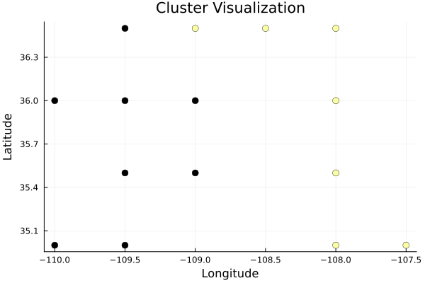

# Validation
```@meta
CurrentModule = MetaCommunityMetrics
```
We validate all the calcuations in `MetaCommunityMetrics` that have equvilant functions in R to make sure the functions in `MetaCommunityMetrics` are correct and accurate as the equvilant functions in R. All validation results are presented to 4 decimal places (±0.0001) here. Floating-point differences between implementations smaller than 0.0001 were considered negligible for both statistical and ecological applications of these metrics.

## Validation Result
*Below is a comparison of the results between `MetaCommunityMetrics` and functions/equivalent implementation in R.*
### Beta Diversity
*Absolute Differences between the results from `MetaCommunityMetrics` and the equvilant functions in R are shown here. All values *
| TestCase                                         | BDtotal | Repl   | RichDif |
|--------------------------------------------------|---------|--------|---------|
| Beta Diversity (Abundance, quant=true)           | 0.0000  | 0.0000 | 0.0000  |
| Beta Diversity (Abundance, quant=false)          | 0.0000  | 0.0000 | 0.0000  |
| Beta Diversity (Presence, quant=false)           | 0.0000  | 0.0000 | 0.0000  |
| Spatial Beta Diversity (Abundance, quant=true)   | 0.0000  | 0.0000 | 0.0000  |
| Spatial Beta Diversity (Abundance, quant=false)  | 0.0000  | 0.0000 | 0.0000  |
| Spatial Beta Diversity (Presence, quant=false)   | 0.0000  | 0.0000 | 0.0000  |
| Temporal Beta Diversity (Abundance, quant=true)  | 0.0000  | 0.0000 | 0.0000  |
| Temporal Beta Diversity (Abundance, quant=false) | 0.0000  | 0.0000 | 0.0000  |
| Temporal Beta Diversity (Presence, quant=false)  | 0.0000  | 0.0000 | 0.0000  |

### Dispersal-niche continuum index
*A plot showing the distribution of the DNCI values of diffent group pairs from different programming language, each pair are runned for 100 times.


### Occupied Patches Proportion
*Absolute Differences between the results from `MetaCommunityMetrics` and the equvilant functions in R are shown here.*
| min_prop_patches | mean_prop_patches | max_prop_patches |
|------------------|-------------------|------------------|
| 0.0000           | 0.0000            | 0.0000           |

### Variability Metrics
*Absolute Differences between the results from `MetaCommunityMetrics` and the equvilant functions in R are shown here.*
| CV_S_L | CV_C_L | CV_S_R | CV_C_R |
|--------|--------|--------|--------|
| 0.0000 | 0.0000 | 0.0000 | 0.0000 |

### Hypervolume
*Absolute Differences between the results from `MetaCommunityMetrics` and the equvilant functions in R are shown here.*
#### Volume
| total  | correlation | Temperature | Precipitation |
|--------|-------------|-------------|---------------|
| 0.0000 | 0.0000      | 0.0000      | 0.0000        |
### Volume dissimilarity
| Metric                 | total  | correlation | Temperature | Precipitation |
|------------------------|--------|-------------|-------------|---------------|
| Bhattacharyya_distance | 0.0000 | 0.0000      | 0.0000      | 0.0000        |
| Mahalanobis_distance   | 0.0000 | 0.0000      | 0.0000      | 0.0000        |
| Determinant_ratio      | 0.0000 | 0.0000      | 0.0000      | 0.0000        |

## Running Validation
- [`The script to run this validation result can be found here.`](https://github.com/cralibe/MetaCommunityMetrics.jl/blob/main/validation/validation.jl)

