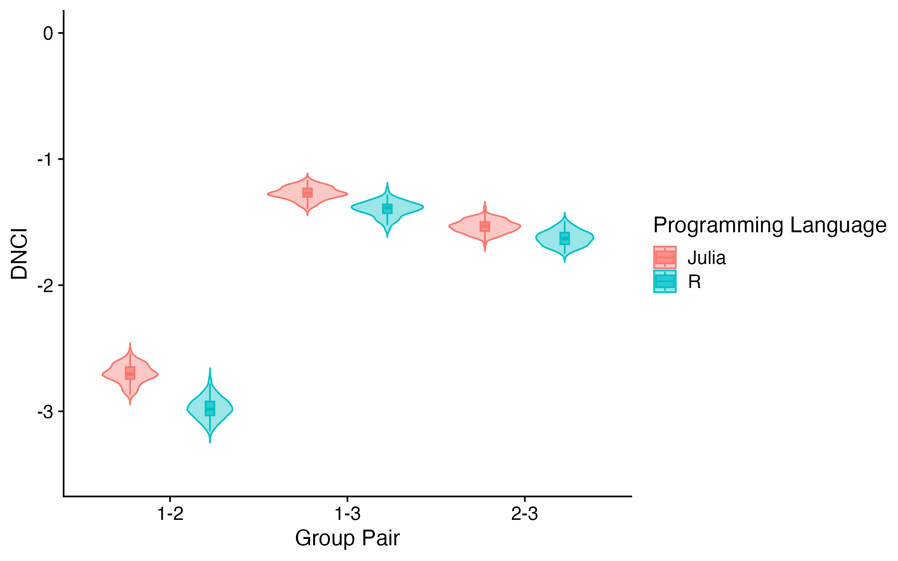

# Validation
```@meta
CurrentModule = MetaCommunityMetrics
```
We validate all the implementation in `MetaCommunityMetrics` that have equvilant implementations in R to make sure the functions in `MetaCommunityMetrics` are correct and accurate as the equvilant functions in R. All validation results are presented to 4 decimal places (±0.0001) here. Except for the DNCI, which is based on permutations (results vary with each permutation), all functions have a result of less than 4 decimal places of absolute difference between ours and the `R` ones. We consider this as floating-point differences between implementations, and differences smaller than 0.0001 were considered negligible for both statistical and ecological applications of these metrics. These minimal differences indicate that our functions are working as intended as the ones in `R`. 

## Validation Result

### Beta Diversity
*Absolute Differences between the results from `MetaCommunityMetrics` and the equvilant functions in R are shown here. All values *

| TestCase                                         | BDtotal | Repl   | RichDif |
|--------------------------------------------------|---------|--------|---------|
| Beta Diversity (Abundance, quant=true)           | 0.0000  | 0.0000 | 0.0000  |
| Beta Diversity (Abundance, quant=false)          | 0.0000  | 0.0000 | 0.0000  |
| Beta Diversity (Presence, quant=false)           | 0.0000  | 0.0000 | 0.0000  |
| Spatial Beta Diversity (Abundance, quant=true)   | 0.0000  | 0.0000 | 0.0000  |
| Spatial Beta Diversity (Abundance, quant=false)  | 0.0000  | 0.0000 | 0.0000  |
| Spatial Beta Diversity (Presence, quant=false)   | 0.0000  | 0.0000 | 0.0000  |
| Temporal Beta Diversity (Abundance, quant=true)  | 0.0000  | 0.0000 | 0.0000  |
| Temporal Beta Diversity (Abundance, quant=false) | 0.0000  | 0.0000 | 0.0000  |
| Temporal Beta Diversity (Presence, quant=false)  | 0.0000  | 0.0000 | 0.0000  |

### Dispersal-niche continuum index
*A plot showing the distribution of the DNCI values of different group pairs from R and Julia, each pair are ran for 100 times, with 1000 permutations each time.


The above plot shows the validation result of the DNCI function using our sample data for the case when `Sampling_date_order` $=$ 60. Our results agree with those from the `R` implementation. All group pairs show ranges of DNCI values significantly smaller than zero across both implementations, and the ranges of each group pair overlap between our implementation and the `R` implementation except for group pair 1-4. These results indicate that both implementations agree that dispersal is the process dominating the metacommunity at the given time point, but our implementation results in a relatively stronger potential strength of dispersal (higher absolute values).

### Occupied Patches Proportion
*Absolute Differences between the results from `MetaCommunityMetrics` and the equvilant functions in R are shown here.*

| min_prop_patches | mean_prop_patches | max_prop_patches |
|------------------|-------------------|------------------|
| 0.0000           | 0.0000            | 0.0000           |

### Variability Metrics
*Absolute Differences between the results from `MetaCommunityMetrics` and the equvilant functions in R are shown here.*

| CV_S_L | CV_C_L | CV_S_R | CV_C_R |
|--------|--------|--------|--------|
| 0.0000 | 0.0000 | 0.0000 | 0.0000 |

### Hypervolume
*Absolute Differences between the results from `MetaCommunityMetrics` and the equvilant functions in R are shown here.*

#### Volume
| total  | correlation | Temperature | Precipitation |
|--------|-------------|-------------|---------------|
| 0.0000 | 0.0000      | 0.0000      | 0.0000        |

#### Volume dissimilarity
| Metric                 | total  | correlation | Temperature | Precipitation |
|------------------------|--------|-------------|-------------|---------------|
| Bhattacharyya_distance | 0.0000 | 0.0000      | 0.0000      | 0.0000        |
| Mahalanobis_distance   | 0.0000 | 0.0000      | 0.0000      | 0.0000        |
| Determinant_ratio      | 0.0000 | 0.0000      | 0.0000      | 0.0000        |

## Running Validation
- [`The script to run this validation result can be found here.`](https://github.com/cralibe/MetaCommunityMetrics.jl/blob/main/validation/validation.jl)

